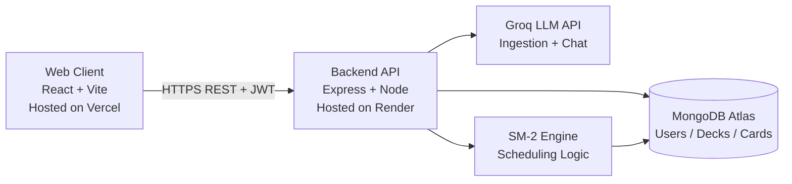

# Flashen - The Flashcard Engine

Flashen is a full-stack, AI-assisted spaced-repetition learning platform that converts PDFs into study decks, schedules reviews with an SM-2 engine, and provides mastery analytics with retention tracking.

## Live Deployments

- Frontend (Vercel): https://flashen-one.vercel.app/
- Backend API (Render): https://flashen.onrender.com/

## Table of Contents

- [Product Overview](#product-overview)
- [Architecture](#architecture)
- [Core Flows](#core-flows)
- [Tech Stack](#tech-stack)
- [Project Structure](#project-structure)
- [API Surface](#api-surface)
- [Environment Variables](#environment-variables)
- [Local Development](#local-development)
- [Testing and QA](#testing-and-qa)
- [Deployment](#deployment)
- [Security and Reliability](#security-and-reliability)
- [Troubleshooting](#troubleshooting)

## Product Overview

Flashen is designed for high-retention learning workflows:

1. Upload a PDF (notes/textbook/chapter).
2. Use AI ingestion to generate deck-ready flashcards.
3. Study in Theater Mode with keyboard-driven grading.
4. Update intervals and ease factors via SM-2.
5. Track progress with mastery analytics and retention heatmaps.
6. Ask the integrated assistant for study guidance.

## Architecture

### High-Level System Design



### Runtime Architecture Notes

- Frontend is a React SPA with lazy-loaded route bundles and protected screens.
- Backend is a stateless Express API with JWT auth middleware and route-level rate limits.
- MongoDB stores user-scoped entities (User, Deck, Card), including telemetry for retention analytics.
- Groq powers both PDF-to-card ingestion and chatbot interactions.
- CORS allowlist supports both local development and deployed origins.

## Core Flows

### 1) Authentication and Session

1. User registers/logs in via /api/auth/register or /api/auth/login.
2. Backend returns JWT + sanitized user profile.
3. Frontend stores token and app state uses protected route guards.

### 2) PDF Ingestion

1. Frontend uploads PDF multipart payload to /api/ingest.
2. Backend extracts PDF text and prompts Groq for structured flashcards.
3. Deck + cards are persisted and returned to the client.

### 3) Study and Scheduling

1. User grades cards in Theater Mode.
2. /api/study/grade applies SM-2 (interval, repetitions, ease factor).
3. nextReview and review telemetry are updated for analytics.

### 4) Analytics and Retention

1. Frontend queries /api/analytics/mastery with browser timezone.
2. Backend aggregates review history + due forecasts.
3. UI renders mastery KPIs, forecast graph, and retention heatmap.

## Tech Stack

### Frontend

- React 19 + Vite
- React Router
- TanStack Query
- Axios
- Framer Motion
- Recharts
- Tailwind CSS
- Lucide Icons

### Backend

- Node.js + Express
- MongoDB + Mongoose
- JWT auth (jsonwebtoken)
- bcryptjs
- multer + pdf-parse
- express-rate-limit
- helmet + cors
- Groq SDK

### QA / Automation

- Playwright (E2E)
- K6 (load testing)

## Project Structure

```text
.
|-- backend/
|   |-- controllers/        # route handlers (auth, ingest, analytics, chat, study)
|   |-- models/             # mongoose schemas (User, Deck, Card)
|   |-- routes/             # API route definitions
|   |-- services/           # core business logic (SM-2)
|   `-- server.js           # app bootstrap, CORS, security, rate limiting
|-- src/
|   |-- components/         # reusable UI (chat, auth, sidebar, effects)
|   |-- hooks/              # TanStack Query hooks and mutations
|   |-- pages/              # route-level screens
|   |-- utils/              # auth/session helpers
|   |-- api.js              # axios client and API base URL handling
|   `-- App.jsx             # route composition and guards
|-- tests/e2e/              # Playwright golden-path tests
|-- stress-test.js          # K6 load test scenario
|-- playwright.config.ts
|-- QA_AUTOMATION.md
`-- QA_MANUAL_CHECKLIST.md
```

## API Surface

All endpoints are served under /api.

### Public

- POST /auth/register
- POST /auth/login

### Protected (JWT)

- GET /user/me
- PATCH /user/accept-terms
- PATCH /user/profile
- POST /ingest
- POST /study/grade
- GET /decks
- DELETE /decks/:deckId
- GET /analytics/mastery
- GET /stats/mastery
- POST /chat

## Environment Variables

### Frontend (Vercel)

| Variable | Required | Example |
|---|---|---|
| VITE_API_URL | Yes | https://flashen.onrender.com/api |
| E2E_BASE_URL | No | http://localhost:5173 |
| E2E_API_URL | No | http://localhost:5000/api |

### Backend (Render)

| Variable | Required | Example |
|---|---|---|
| PORT | Yes | 5000 |
| MONGO_URI | Yes | mongodb://... |
| JWT_SECRET | Yes | your_jwt_secret |
| GROQ_API_KEY | Yes | gsk_... |
| GROQ_MODEL | Yes | llama-3.1-8b-instant |
| CLIENT_URL | Yes | https://flashen-one.vercel.app |
| API_RATE_LIMIT_MAX | No | 200 |
| REFRESH_LIMIT_WINDOW_MS | No | 600000 |
| REFRESH_LIMIT_MAX | No | 60 |
| CHAT_RATE_WINDOW_MS | No | 60000 |
| CHAT_RATE_MAX | No | 15 |

## Local Development

### Prerequisites

- Node.js 18+
- npm 9+
- MongoDB (local or Atlas)

### 1) Install dependencies

```bash
# frontend (project root)
npm install

# backend
cd backend
npm install
```

### 2) Configure environment

Create local env files:

- root .env
- backend/.env

Minimum local values:

```env
# root .env
VITE_API_URL=http://localhost:5000/api
```

```env
# backend/.env
PORT=5000
MONGO_URI=mongodb://localhost:27017/flashcard-engine
JWT_SECRET=dev_secret
GROQ_API_KEY=your_key
GROQ_MODEL=llama-3.1-8b-instant
CLIENT_URL=http://localhost:5173
```

### 3) Run services

```bash
# terminal 1 (backend)
cd backend
npm run dev

# terminal 2 (frontend)
cd ..
npm run dev
```

## Testing and QA

### Frontend Build

```bash
npm run build
```

### E2E (Playwright)

```bash
npm run test:e2e:golden
npm run test:e2e
npm run test:e2e:report
```

### Load Test (K6)

```bash
npm run test:load
```

Notes:

- K6 must be installed globally on your machine.
- Load test credentials can be provided with K6_EMAIL and K6_PASSWORD.

See also:

- QA_AUTOMATION.md
- QA_MANUAL_CHECKLIST.md

## Deployment

### Frontend (Vercel)

1. Connect repository to Vercel.
2. Set env variable VITE_API_URL=https://flashen.onrender.com/api.
3. Build command: npm run build.
4. Output directory: dist.

### Backend (Render)

1. Create Web Service from backend directory.
2. Start command: npm start.
3. Set required environment variables from the table above.
4. Ensure CLIENT_URL includes deployed frontend URL.

## Security and Reliability

- Helmet enabled for secure HTTP headers.
- CORS allowlist with normalized origin validation.
- Global and route-level rate limiting.
- JWT authentication for protected routes.
- Owner-scoped queries for deck/card isolation.
- Centralized error handling in backend router and app layer.

## Troubleshooting

### CORS errors in production

- Verify Render CLIENT_URL includes the Vercel domain.
- Verify VITE_API_URL points to Render /api endpoint.
- Redeploy both frontend and backend after env updates.

### Dev server fails to connect API

- Confirm backend is running on expected port.
- Confirm root .env VITE_API_URL matches backend URL.
- Confirm MongoDB and GROQ_API_KEY are valid.

### Empty analytics data

- Ensure study events are being submitted to /api/study/grade.
- Ensure cards have review telemetry (reviewLog/reviewCount).

---

If you want, this README can be extended with a separate docs folder for architecture decision records (ADRs), API schemas, and runbooks for incident response.
